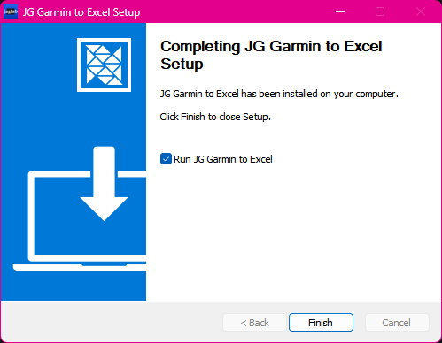
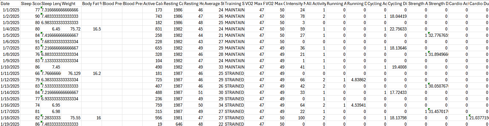

# Garmin Data to Excel and CSV Utility

A tool for downloading health metrics from Garmin Connect to CSV/Excel files, with both desktop and command-line interfaces. Includes a Windows installer release.

## Screenshots

Running the utility on Windows:


*Simple utility to download daily data from Garmin and store it in an Excel sheet (XLSX) or CSV.*

Windows installer:



*JG Garmin to Excel Windows installer.*

Garmin data output in Excel sample:



*Garmin data output example.*

## Features

- Sync daily health metrics from Garmin Connect
- Export to CSV and XLSX formats
- Desktop application with user-friendly interface
- Command-line interface for automation
- Docker support for containerized deployment
- Secure credential handling
- Configurable date ranges
- Dark theme optimized UI

## Metrics Collected

- Sleep metrics (score, duration)
- Weight and body fat
- Blood pressure
- Calories (active and resting)
- Heart rate metrics
- Stress levels
- VO2 Max (running and cycling)
- Activity summaries
- Training status
- And more...

## Installation

### Windows Installer

1. Download the Windows installer from the Releases https://github.com/jagbanana/jg-garmin-excel-csv/releases
2. Run the installer.

## Dev Environment Creation

## Environment Setup

1. Clone the repository:
```
git clone https://github.com/yourusername/garmin-sync.git
cd garmin-sync
```

2. Install Python dependencies:
```
python -m venv venv
source venv/bin/activate  # Linux/Mac
# or
.\venv\Scripts\activate  # Windows
pip install -r requirements.txt
```

3. Install Node.js dependencies:
```
npm install
```

### Environment Usage

Run both the backend and frontend with a single command:
```
npm run dev
```
## Project Structure

```
JG-GARMIN-EXCEL-CSV/
├── backend/         # Python FastAPI backend
│   ├── src/
│   │   ├── api/
├── frontend/        # Electron-based frontend
│   ├── src/
│   │   ├── assets/  # Icons and images
│   │   ├── js/      # Frontend JavaScript
│   │   └── styles/  # CSS files
├── logs/            # Application logs
└── screenshots/     # Documentation images
```

## Development

### Tech Stack

- Backend:
  - Python 3.9+
  - FastAPI
  - garminconnect
- Frontend:
  - Electron
  - HTML/CSS/JavaScript
  - Custom date picker and UI components
- Build Tools:
  - electron-builder
  - PyInstaller

### Setup Development Environment

1. Clone the repository
2. Install Python dependencies: pip install -r requirements.txt
3. Install Node dependencies:

```
cd frontend
npm install
```

4. Start the backend server and frontend Electron app

```
npm run dev
```

## Contributing

1. Fork the repository
2. Create a feature branch: git checkout -b feature/your-feature
3. Commit changes: git commit -am 'Add your feature'
4. Push to branch: git push origin feature/your-feature
5. Submit a Pull Request

## License
MIT License - see LICENSE file for details

## Security
This application handles sensitive login credentials. Always:

- Use environment variables for credentials
- Never commit .env files
- Use secure storage for desktop app credentials
