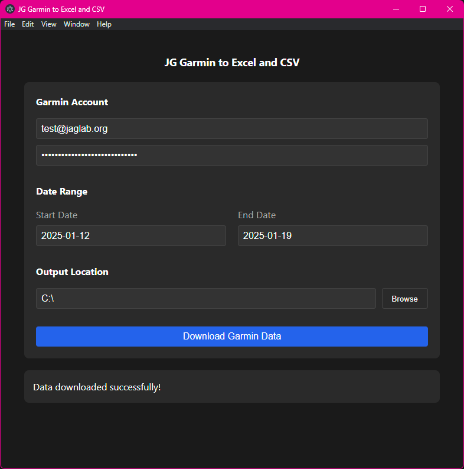

# Garmin Data to Excel and CSV Utility

A tool for downloading health metrics from Garmin Connect to CSV/Excel files, with both desktop and command-line interfaces.

## Screenshots

Running the utility on Windows:

*Simple utility to download daily data from Garmin and store it in an Excel sheet (XLSX) or CSV.*

## Features

- Sync daily health metrics from Garmin Connect
- Export to CSV and XLSX formats
- Desktop application with user-friendly interface
- Command-line interface for automation
- Docker support for containerized deployment
- Secure credential handling
- Configurable date ranges
- Dark theme optimized UI

## Metrics Collected

- Sleep metrics (score, duration)
- Weight and body fat
- Blood pressure
- Calories (active and resting)
- Heart rate metrics
- Stress levels
- VO2 Max (running and cycling)
- Activity summaries
- Training status
- And more...

## Installation

### Desktop Application

1. Download the latest release for your platform
2. Install the application
3. Launch and enter your Garmin credentials

### Command Line / Docker

1. Clone the repository:
```
git clone https://github.com/yourusername/garmin-sync.git
cd garmin-sync
```

2. Create a virtual environment (optional but recommended):

```
python -m venv venv
source venv/bin/activate  # Linux/Mac
# or
.\venv\Scripts\activate  # Windows
```

3. Install dependencies:
```
pip install -r requirements.txt
```

4. Set up environment variables:

```
cp .env.example .env
```

## Usage
### Desktop Application

1. Launch the application
2. Enter your Garmin Connect credentials
3. Select date range
4. Choose output location
5. Click "Sync Data"

To launch the application with Node.js from the root folder:
```
npm run dev
```

## Alternative Methods
### Command Line

```
python -m src.main sync-cli \
  --start-date 2024-01-01 \
  --end-date 2024-01-15 \
  --email your.email@example.com \
  --password yourpassword \
  --output-dir /path/to/output
```

### Docker

```
docker build -t garmin-sync .
docker run -v /local/output:/app/output garmin-sync \
  --start-date 2024-01-01 \
  --end-date 2024-01-15 \
  --email your.email@example.com \
  --password yourpassword
```

## Development

### Prerequisites

- Python 3.9+
- Node.js 16+
- Electron
- FastAPI
- Docker (optional)

### Setup Development Environment

1. Clone the repository
2. Install Python dependencies: pip install -r requirements.txt
3. Install Node dependencies:

```
cd frontend
npm install
```

4. Start the backend server and frontend Electron app

```
npm run dev
```

## Contributing

1. Fork the repository
2. Create a feature branch: git checkout -b feature/your-feature
3. Commit changes: git commit -am 'Add your feature'
4. Push to branch: git push origin feature/your-feature
5. Submit a Pull Request

## License
MIT License - see LICENSE file for details

## Security
This application handles sensitive login credentials. Always:

- Use environment variables for credentials
- Never commit .env files
- Use secure storage for desktop app credentials
